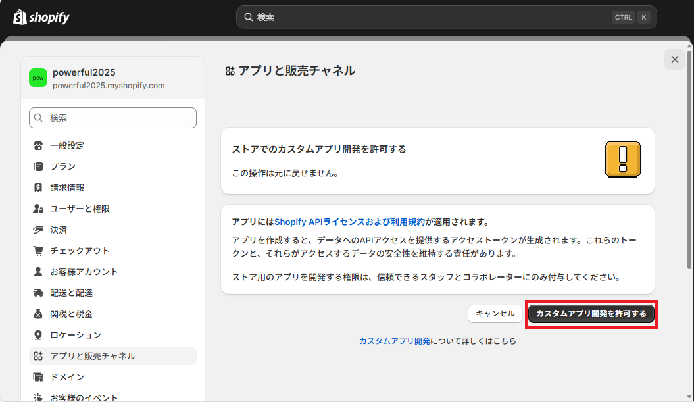
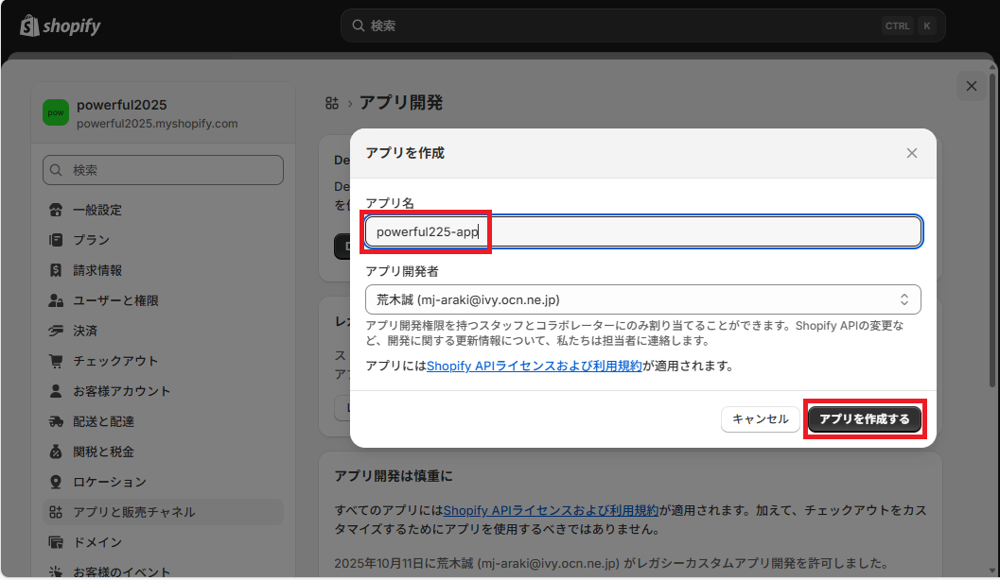

# Powerful2025 (Shopify - 開発ストア)
## 前提条件
- Shopify Partner アカウント作成
- 開発ストアを作成済
- サンプル商品を登録済

## 環境構築
### Shopify CLI インストール準備
```bash
## Ubuntuのバージョン確認(Ubuntu 22.04以上を推奨)
$ lsb_release -a

## 必要パッケージのインストール
$ sudo apt update
$ sudo apt install -y curl git build-essential

## Node Version Manager(nvm)のインストール
$ curl -o- https://raw.githubusercontent.com/nvm-sh/nvm/v0.39.6/install.sh | bash

## シェル環境に反映
$ source ~/.bashrc

## バージョン確認
$ nvm --version

## Node.jsのインストール
$ nvm install --lts

## デフォルト設定
$ nvm alias default lts/*

## Node.jsのバージョン確認
$ node -v

## Node Package Manager(npm)のバージョン確認
$ npm -v
```

### Shopify CLI インストール作業
```bash
## グローバルインストール
$ npm install -g @shopify/cli@latest

## Shopify CLIのバージョン確認
$ shopify version

## ヘルプ表示
$ shopify help
```

### ローカルリポジトリ設定、テーマをダウンロード、リモートリポジトリにプッシュ
```bash
## ディレクトリ作成
$ mkdir ~/powerful2025

## ディレクトリ移動
$ cd ~/powerful2025

## ローカルリポジトリ初期化
$ git init

## ユーザー情報設定
$ git config --global user.email (自分のメールアドレス)
$ git config --global user.name Makoto-Araki

## リモートリポジトリ設定
$ git remote add origin git@github.com:Makoto-Araki/powerful2025.git

## Shopify テーマダウンロード
$ shopify theme pull --store powerful2025.myshopify.com

コマンドの実行結果
----------------------------------------------------------------------
To run this command, log in to Shopify.
User verification code: FFLF-LBTD
Press any key to open the login page on your browser
Opened link to start the auth process: https://accounts.shopify.com/activate-with-code?device_code%5Buser_code%5D=FFLF-LBTD
✔ Logged in.  // 上記のURLのページが開きユーザー認証

(中略)

?  Do you want to proceed?
✔  Yes, confirm

(中略)

?  Select a theme to open:
✔  Rise  // 開発ストアのテーマ名を選択

(中略)
----------------------------------------------------------------------

## Shopify テーマファイル確認
$ ls -l

コマンドの実行結果
----------------------------------------------------------------------
drwxr-xr-x 2 makoto makoto 12288 Sep 25 07:09 assets
drwxr-xr-x 2 makoto makoto  4096 Sep 25 07:09 config
drwxr-xr-x 2 makoto makoto  4096 Sep 25 07:09 layout
drwxr-xr-x 2 makoto makoto  4096 Sep 25 07:09 locales
drwxr-xr-x 2 makoto makoto  4096 Sep 25 07:09 sections
drwxr-xr-x 2 makoto makoto  4096 Sep 25 07:09 snippets
drwxr-xr-x 3 makoto makoto  4096 Sep 25 07:09 templates
----------------------------------------------------------------------

## コミットとリモートリポジトリにプッシュ
$ git add .
$ git commit -m Shopifyからpull直後
$ git push origin main
```

### 管理画面上のテーマエディタでテーマ修正後
```bash
## ディレクトリ移動
$ cd ~/powerful2025

## Shopify テーマダウンロード
$ shopify theme pull --store powerful2025.myshopify.com

## Shopify テーマファイル確認
$ ls -l

## コミットとリモートリポジトリにプッシュ
$ git add .
$ git commit -m Shopifyからpull直後
$ git push origin main
```

### ローカルリポジトリ上でテーマファイル修正
```bash
## ディレクトリ移動
$ cd ~/powerful2025

## Shopify テーマファイル確認
$ ls -l

コマンドの実行結果
----------------------------------------------------------------------
drwxr-xr-x 2 makoto makoto 12288 Sep 25 07:09 assets
drwxr-xr-x 2 makoto makoto  4096 Sep 25 07:09 config
drwxr-xr-x 2 makoto makoto  4096 Sep 25 07:09 layout
drwxr-xr-x 2 makoto makoto  4096 Sep 25 07:09 locales
drwxr-xr-x 2 makoto makoto  4096 Sep 25 07:09 sections
drwxr-xr-x 2 makoto makoto  4096 Sep 25 07:09 snippets
drwxr-xr-x 3 makoto makoto  4096 Sep 25 07:09 templates
----------------------------------------------------------------------

## テーマファイル修正
$ vi assets/component-newletter.css

コマンドの実行結果
----------------------------------------------------------------------
(中略)

.footer-block--newsletter .field__label::before {
  content: 'Input your Email';
  color: green;  // ここを purple に変更
}
----------------------------------------------------------------------

## Shopify ローカルプレビューモード
$ shopify theme dev --store powerful2025.myshopify.com

コマンドの実行結果
----------------------------------------------------------------------
(中略)

Preview your theme (t)
・http://127.0.0.1:9292  // プレビュー画面のURL表示、プレビュー確認後に「Ctrl + C」で停止

(中略)
----------------------------------------------------------------------

## Shopify テーマプッシュ
$ shopify theme push --store powerful2025.myshopify.com

コマンドの実行結果
----------------------------------------------------------------------
?  Select a theme to push to:
✔  Rise  // 現在、公開中(LIVE)のテーマを選択、本来は別テーマにプッシュして、管理画面上でもプレビューするべき…

?  Push theme files to the live theme on powerful2025.myshopify.com?
✔  Yes, confirm changes
----------------------------------------------------------------------

## コミットとリモートリポジトリにプッシュ
$ git add .
$ git commit -m 文字色を変更
$ git push origin main
```

## 開発時のテーマ複製の方針
### 初期状態

1. Riseが公開状態

### 開発案件01

1. RiseからRise_20251007_01_backupを複製
1. RiseからRise_20251007_01_editを複製
1. Rise_20251007_01_edit上で開発
1. Rise_20251007_01_editをプレビュー
1. Rise_20251007_01_editを公開
```note
※上記3でliquidファイル編集が必要な案件の場合は、テーマダウンロード後にローカルリポジトリ上で修正、プレビューの確認後にRise_20251007_01_editに反映すること
```

### 開発案件02

1. Rise_20251007_01_editからRise_20251007_02_backupを複製
1. Rise_20251007_01_editからRise_20251007_02_editを複製
1. Rise_20251007_02_edit上で開発
1. Rise_20251007_02_editをプレビュー
1. Rise_20251007_02_editを公開

### 開発案件03

1. Rise_20251007_02_editからRise_20251010_01_backupを複製
1. Rise_20251007_02_editからRise_20251010_01_editを複製
1. Rise_20251010_01_edit上で開発
1. Rise_20251010_01_editをプレビュー
1. Rise_20251010_01_editを公開

## Admin API アクセストークン取得
### Shopify管理画面
#### 手順01

#### 手順02

#### 手順03

#### 手順04

#### 手順05

#### 手順06

#### 手順07

#### 手順08

#### 手順09

#### 手順10

#### 手順11

#### 手順12

#### 手順13

#### 手順14

#### 手順15

#### 手順16
- 表示されたアクセストークンを保管する